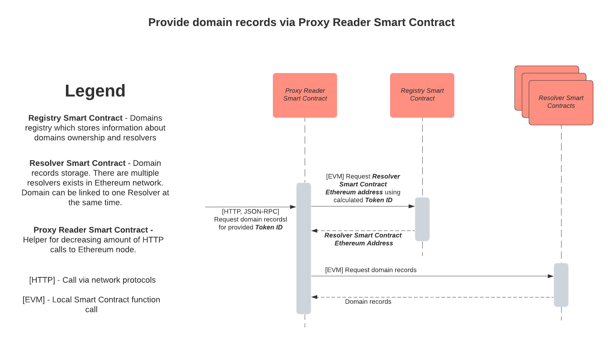

# Architecture

This section explains the components of crypto registry, its core design principles and permission model.

## Registry Essentials

<!-- TODO: Add high level diagram on Ethereum infrastructure -->

The essential part of the registry is to allow one to own a domain and associate records to it. 

Domain ownership is held in a form of [ERC721 token](https://eips.ethereum.org/EIPS/eip-721).
A domain name is converted to an ERC721 token using a [Namehashing](#namehashing) algorithm.
The records have a key-value form. 
**Multiple records with the same key are unsupported** at the low level and have to be simulated in higher level. See [Records Reference](./RECORDS_REFERENCE.md). An attempt to add a record that already exist on resolver will result in record value being overwritten.

In addition to this, the registry design has a capability for flexible records managements that allows to implement any records management permission model.
The flexibility is achieved by introducing a Resolver contract as a separated contract that can hold records and associating a domain with a single resolver contract address.
Records can be associated to a domain ONLY via a Resolver contract. 
A single resolver can hold records for multiple domains.

A fragment of Registry contract that shows how ownership and resolvers information is persisted:

``` solidity
// Mapping from ERC721 token ID to a resolver address
mapping (uint256 => address) internal _tokenResolvers;
// Maping from ERC721 token ID to an owner address
// Part of ERC721 standard
mapping (uint256 => address) internal _tokenOwners;
```

There are other permission structures (approved address and operators) available as part of ERC721 standard but they do not have any custom functionality on top. See the ERC721 standard for more information on those topics.

Registry is a "singleton" contract and only exists in a single production instance deployed at [0xD1E5b0FF1287aA9f9A268759062E4Ab08b9Dacbe](https://etherscan.io/address/0xD1E5b0FF1287aA9f9A268759062E4Ab08b9Dacbe). [Source Code](./contracts/Registry.sol).

Resolver data structure looks in the following way (pseudocode):

``` solidity
//Mapping of ERC721 token ID to key-value records mapping
mapping (uint256 =>  mapping (string => string)) internal _records;
```

Unstoppable Domains provides a default public resolver contract deployed at [0xb66DcE2DA6afAAa98F2013446dBCB0f4B0ab2842](https://etherscan.io/address/0xb66DcE2DA6afAAa98F2013446dBCB0f4B0ab2842). [Source Code](./contracts/Resolver.sol).

<div id="namehashing"></div>

### Namehashing Domain Name

Namehashing is an algorithm that converts a domain name in a classical format (like `www.example.crypto`) to ERC721 token id.
All .crypto ecosystem contracts accept domain name as a method argument in a form of ERC721 token.
Namehashing is defined as a part of [EIP-137](https://github.com/ethereum/EIPs/blob/master/EIPS/eip-137.md#namehash-algorithm) standard. 
[Example implementation](https://github.com/unstoppabledomains/resolution/blob/master/src/cns/namehash.ts) in JavaScript. 
See the standard for a text description of the algorithm.

One can verify his implementation of namehashing algorithm using the following reference table:

| Domain Name                 | ERC721 Token                                                          |
|-----------------------------|-----------------------------------------------------------------------|
| `.`                         | `0x0000000000000000000000000000000000000000000000000000000000000000`  |
| `crypto`                    | `0x0f4a10a4f46c288cea365fcf45cccf0e9d901b945b9829ccdb54c10dc3cb7a6f`  |
| `example.crypto`            | `0xd584c5509c6788ad9d9491be8ba8b4422d05caf62674a98fbf8a9988eeadfb7e`  |
| `www.example.crypto`        | `0x3ae54ac25ccd63401d817b6d79a4a56ae7f79a332fe77a98fa0c9d10adf9b2a1`  |
| `welcome.to.ukraine.crypto` | `0x8c2503ec1678c38aea1bb40b2c878feec5ba4807ab16293cb53cbf0b9a8a0533`  |

#### Inverse namehashing

Fundamentally namehashing is built to be a one way operation.
However, crypto registry remembers all the domain names that were ever minted with their corresponding namehash: [source code](https://github.com/unstoppabledomains/dot-crypto/blob/master/contracts/Registry.sol#L17).
That makes it possible to obtain an original domain name from a namehash via ETH RPC call to [Registry#tokenURI](https://github.com/unstoppabledomains/dot-crypto/blob/master/contracts/Registry.sol#L51).

<div id="registry-controllers"></div>

### Registry Controllers

At the moment when crypto registry was deployed, Ethereum platform had a limitation on the contract size. [Removing Contract Size Limit Issue](https://github.com/ethereum/EIPs/issues/1662).

In order to avoid that limitation, some registry methods are moved to Controller Contracts. A method sent to controller contract will act as if it was sent to original registry.
The list of controllers addresses is **irreversibly locked** on the Registry and can not be modified in the future.

A list of controller contracts and their source can be found in [List of Contracts](./README.md#deployed-contracts)

<div id="domains-minting"></div>

### Domains Minting and Hierarchy

Registry comes with a pre-generated top level domain `crypto`.
A process of making a new domain is referenced as "minting" in the source code and documentation.
Generally any domain owner can mint a subdomain via [Registry#mintChild](https://github.com/unstoppabledomains/dot-crypto/blob/master/contracts/Registry.sol#L79).

Example: an owner of domain `example.crypto` can mint a domain `home.example.crypto` in the following way:

```
mintChild(subdomainOwner, namehash('example.crypto'), 'home')
```

Note: `subdomainOwner` usually matches the owner of the original domain.

Parent domain owners are having a full control over child domains by having an ability to transfer the ownership of subdomain via
[Registry#transferFromChild](https://github.com/unstoppabledomains/dot-crypto/blob/master/contracts/Registry.sol#L111).

Example: transferring a subdomain `home.example.crypto` from previous example to original owner can look like:

```
transferFromChild(subdomainOwner, originalDomainOwner, namehash('example.crypto'), 'home')
```

`crypto` top level domain's owner is set to `0x0000000000000000000000000000000000000000000000000000000000000000` address that no one owns. So, the second level domains minting is done via a [MintingController.sol](./contracts/MintingController.sol) which is only allowed to mint non existing domains without any ability to control those domains after they are minted.

The permanent ownership of second level domains is guaranteed as there is no fee for owning a domain and no permission to revoke the ownership at higher level.
People wanting to propagate this permission model to subdomains (e.g. converting them into zones) can follow the same pattern for domains they own.

There is no technical limit of how deep subdomains tree can go. There might be limitations on the client side, but they are not recommended.

<div id="domain-resolution"></div>

## Resolving a domain

Resolving a domain is a process of retrieving a domain records when the domain name and required record names are given.
There is no limitation on who can read domain records on Registry side. Anyone having an access to Ethereum Node on the mainnet can resolve a domain.

Resolving a domain requires a software to have an access to ethereum network. See [Network Configuration](#network-configuration) for more information

In order to resolve a domain, one would require to make 2 `eth_call` ethereum JSON RPC method calls:

1. Get resolver address via `Registry#resolverOf(tokenId)` where `tokenId` is a ERC721 token of a given domain
2. Get record values via `Resolver#getMany(keys, tokenId)` where `keys` are record names.

Pseudocode example in JavaScript: 

``` typescript
const RegistryAddress = "0xD1E5b0FF1287aA9f9A268759062E4Ab08b9Dacbe";
const domain = "example.crypto";
const tokenId = namehash(domain)
const keys = ["crypto.ETH.address", "crypto.BTC.address"];
const resolverAddress = ethCall(RegistryAddress, "resolverOf", tokenId);
const values = ethcall(resolverAddress, "getMany", keys, tokenId);
keys.forEach((k, i) => console.log(k, values[i]));
```

  

Reference:

* `namehash` - namehashing algorithm implementation. See [Namehashing](#namehashing).
* `echCall` - Ethereum JSON RPC implementation for `eth_call` method. See [Ethereum JSON RPC](https://eth.wiki/json-rpc/API#eth_call)

See [Records Reference](./RECORDS_REFERENCE.md) for more information on which specific records to query.

### Record Value Validation

Crypto resolver doesn't have any built-in record value validation when it is updated for two reasons:

* Any validation would require additional gas to be paid
* Solidity is special purpose programming language that doesn't have any built-in data validation tools like Regular Expressions

Any domain management application must perform record format validation before submitting a transaction.
However, there is no guarantee that all management application will do it correctly. 
That is why records must be validated when domain is resolved too.

See [Records Reference](./RECORDS_REFERENCE.md) for more information for the validator of each record.

<div id="network-configuration"></div>

### Configuring Ethereum Network connection

Domain Resolution Configuration at low level requires 3 configuration parameters:

1. Ethereum JSON RPC provider
2. Ethereum CHAIN ID
3. Crypto Registry Contract Address

Ethereum JSON RPC provider is an API implementing Ethereum JSON RPC standard. Usually, it is given in a form of HTTP API end point. However, other forms may exist in case when ethereum node is launched locally.
Unstoppable domains recommends [Cloudflare Ethereum Gateway](https://developers.cloudflare.com/distributed-web/ethereum-gateway) an ethereum node service provider.

Ethereum CHAIN ID is an ID of ethereum network a node is connected to. Each RPC provider can only be connected to one network. There is only one production network with CHAIN ID equal to `1` and called `mainnet`. Other networks are only used for testing purposes of different kinds. See [EIP-155](https://eips.ethereum.org/EIPS/eip-155) for more information. CHAIN ID of an ethereum node can be determined by calling [net version method](https://eth.wiki/json-rpc/API#net_version) on JSON RPC which should be used as a default when only JSON RPC provider is given.

Crypto Registry Contract Address is an actual address of a contract deployed. There is only one production registry address on the mainnet: [0xD1E5b0FF1287aA9f9A268759062E4Ab08b9Dacbe](https://etherscan.io/address/0xD1E5b0FF1287aA9f9A268759062E4Ab08b9Dacbe). This address should be used as a default for production configuration.

<!-- ### Retrieving all records -->

<!-- Current Resolver allows one to retrieve all crypto records of a domain. However, due to some limitation of Ethereum Technology and gas price optimizations on management, it comes with a significant performance downside requiring one to do at least 3 queries to blockchain. In case when a domain has 1000+ records or large records changes history, it can require more. -->

<!-- TODO: describe the algorithm -->

<div id="management"></div>

## Managing domain records 

Domain records can be managed via default public resolver.
One can develop its own custom resolver with any management permissions defined. 

### Using Default Public Resolver

Default public resolver allows to manage all domain records for any address given a permission over domain as per [ERC721 "Transfer Mechanism"](https://eips.ethereum.org/EIPS/eip-721) section. These includes:

* Owner address of a domain 
* Approved address for a domain
* Owner's operator addresses

See ERC721 on how those permissions can be granted and revoked.
Any records change is submitted as a [Ethereum Blockchain Transaction](https://ethereum.org/en/whitepaper/#messages-and-transactions). 

Records Management can be done via [Resolver methods](https://github.com/unstoppabledomains/dot-crypto/blob/master/contracts/IResolver.sol).

### Meta-transactions support

Most Registry and Resolver methods have a [meta-transaction](https://docs.openzeppelin.com/learn/sending-gasless-transactions) support. Generally meta-transactions allow to separate a transaction signer address from a transaction funding address. So an address used to generate a meta-signature is used to check a permission for an operation and classical signer address is used to withdraw a transaction fee.

For each management method, there is a method with meta-transaction support that has `For` suffix at the end. Example: `resetFor` is a meta-transaction version of `reset`. This method has an additional `signature` argument as a last parameter beside all original parameters. A meta-transaction method checks the permission for a domain against the address that generated the signature argument, unlike base method that checks it against Solidity `_sender` keyword.

Note that a meta-transaction version of a function of the Registry can be implemented in controller contract but not registry itself. See [Registry Controllers](#registry-controllers).

Meta transaction methods are bound to domain based nonce (instead of [Account Nonce](https://ethereum.stackexchange.com/questions/27432/what-is-nonce-in-ethereum-how-does-it-prevent-double-spending) of traditional transactions). It protects from [Double-spending](https://en.wikipedia.org/wiki/Double-spending) in the same way as account based nonce in traditional transactions. 

A source code of signature validation can be found in [SignatureUtil.sol](./contracts/utils/SignatureUtil.sol)


#### Meta transaction signature generation

Meta transaction requires 2 signature: one passed as a method argument and one classical. Classical signature is generated in a standard way. Meta signature requires a domain owner (or a person approved by owner) to sign a special message formed from:

* Domain based meta-transaction nonce
* [Function Selector](https://solidity.readthedocs.io/en/v0.7.0/abi-spec.html#function-selector) of the original method
* Original Method parameters (the one without signature)

Example Signature generation for a `reset` method call for a domain:

``` typescript
const domain = 'example.crypto';
const methodName = 'reset';
const methodParams = ['uint256'];
const contractAddress = '0xb66DcE2DA6afAAa98F2013446dBCB0f4B0ab2842';
// Can be different or the same as contractAddress
const controllerContractAddress = '0xb66DcE2DA6afAAa98F2013446dBCB0f4B0ab2842';
const tokenId = namehash(domain);

function generateMessageToSign(
  contractAddress: string,
  signatureContract: string,
  methodName: string,
  methodParams: string[],
  tokenId: string,
  params: any[],
) {
  return solidityKeccak256(
    ['bytes32', 'address', 'uint256'],
    [
      solidityKeccak256(
        ['bytes'],
        [encodeContractInterface(contractAddress, method, methodParams, params)],
      ),
      controllerContractAddress,
      ethCallRpc(controllerContractAddress, 'nonceOf', tokenId),
    ],
  );
}

const message = generateMessageToSign(
  contractAddress,
  signagureContractAddress,
  methodName,
  methodParams,
  tokenId,
  [tokenId]
);
```

Functions Reference:

* `namehash`  - [Namehashing Function](#namehashing) algorithm implementation
* `ethCallRpc` - Ethereum `eth_call` JSON RPC implementation
* `encodeContractInterface` - [Solidity ABI](https://solidity.readthedocs.io/en/v0.7.0/abi-spec.html#argument-encoding) interface parameters encoder
* `solidityKeccak256` - [Solidity ABI](https://solidity.readthedocs.io/en/v0.7.0/abi-spec.html#argument-encoding) parameters encoder

<!-- TODO: clarify encodeContractInterface and solidityKeccak256, put examples implementation -->


### Deploying Custom Resolver

Custom Resolver is a way to implement a flexible permission model over domain records.
This may include: 

* Community owned domains - individual members of a community decide on a domain website content
* Domain leasing - a domain is temporary managed by a different authority and then comes back to original authority

Custom resolver can be implemented as a separated contract and its address can be assigned as a domain resolver via `Registry#resolveTo`.

Custom resolver must implement interfaces [IResolverReader](./contracts/IResolverReader.sol) and [ERC165](https://github.com/ethereum/EIPs/blob/master/EIPS/eip-165.md)

<!-- 
TODO more information on which interface should be implemented by custom resolver: 
extract Resolver records reading interface into separated solidity interface
-->
<!-- TODO Sync mechanism description -->
<!-- TODO Explain Resolver events: NewKey, Set, ResetRecords -->

<div id="main-records"></div>

## Main Records

Records on top level are stored in a simple key-value mapping of string to string.
Crypto registry doesn't forbid a user to assign any record to any value.
However, there is a list of standard records that have a defined standard interpretation by clients.
A full list of standardized records can be found in [Records Reference](./RECORDS_REFERENCE.md).

Standard record keys are split by namespaces with `.` used as a separator.

Main namespaces are:

* `crypto.*` - records related to crypto payments
* `dns.*` - DNS records
* `dweb.*` - records related to distributed content network protocols
* `browser.*` - hint records for web browsers

<div id='crypto-payments'></div>

### Crypto Payments Records

One of essential feature of crypto domains is the ability to make specify a domain instead of a destination address for your crypto payment.
Crypto Wallets that need this feature should revolve a domain to crypto address under the hook in the same way browser resolves a domain to IP address.

All crypto addresses are stored within `crypto.*` namespace.
Each currency address is stored as `crypto.<TICKER>.address` record. Example: Bitcoin address is stored in `crypto.BTC.address`.
Addresses are stored in plain text format according to an address space standard established by each individual currency
Currency namespace can contain additional currency specific attributes to facilitate payment delivery. Example: [Ripple Destination Tag](https://xrpl.org/source-and-destination-tags.html). However, key names for those attributes are not yet standardized. Please contact [Unstoppable Domains Support](mailto:support@unstoppabledomains.com) if you need such attributes to be added to the standard.

Some tickers of very popular crypto currencies are not yet standardized. Example: `LINK` for [Chainlink](https://coinmarketcap.com/currencies/chainlink).
Standardized list of tickers can be found in [SLIP-0044](https://github.com/satoshilabs/slips/blob/master/slip-0044.md). However, more extended list of conventional tickers is available at [cripti/cryptocurrencies](https://github.com/crypti/cryptocurrencies/blob/master/cryptocurrencies.json).

Example crypto records setup:

| Key                  | Value                                        |
|----------------------|----------------------------------------------|
| `crypto.ETH.address` | `0xD1E5b0FF1287aA9f9A268759062E4Ab08b9Dacbe` |
| `crypto.BTC.address` | `bc1qkd4um2nn2uyzmsch5y86wsa2pfh8xl445lg9nv` |
| `crypto.ZIL.address` | `zil1yu5u4hegy9v3xgluweg4en54zm8f8auwxu0xxc` |

<div id='dns-records'></div>

### DNS records

Resolver records may contain classical DNS records besides other records. In order to distinguish those from other crypto records, the `dns.*` namespace is used.  So DNS `A` corresponds to `dns.A` crypto record. Any [listed DNS record](https://en.wikipedia.org/wiki/List_of_DNS_record_types) described in RFC standards is supported. All record names must follow upper case naming convention.

As crypto resolver doesn't support multiple records with the same key, but DNS does allow that. Therefore, DNS record value must always be stored as [JSON](http://json.org) serialized array of strings. 
Example 1: a domain that needs one `CNAME` record set to `example.com.` must be configured as one crypto record `dns.CNAME` set to `["example.com."]`.
Example 2: a domain that needs two `A` records set to `10.0.0.1` and `10.0.0.2` must be configured as one crypto record `dns.A` set to `["10.0.0.1","10.0.0.2"]`.

No other data transformation is required when converting a traditional DNS record into Crypto record other than aggregating records with the same name to one record using serialization as JSON array of strings.

Crypto records do not have a domain name associated to them. That is why there is no feature of storing your subdomain records inside a parent domain.
Example: `www.example.com` record can only be set inside a resolver of `www.example.com` but never inside `example.com`.

A recommended way to display content in a browser for crypto domains is explained in [Browser Resolution How-to](./BROWSER_RESOLUTION_HOWTO.md)

#### TTL

Records TTL can be set for all records or for individual type of record. TTL for all records can be set in `dns.ttl`. TTL for individual record type can be set in `dns.<RECORD>.ttl`. If `ttl` for individual record type is not set, a default `dns.ttl` need to be applied.

Example crypto records setup:

| Record    | Value                        |
|-----------|------------------------------|
| dns.A     | ["10.0.0.1", "10.0.0.2"]     |
| dns.A.ttl | 168                          |
| dns.AAAA  | ["2a00:1450:401b:805::200e"] |
| dns.MX    | ["10 aspmx.example.com."]    |
| dns.ttl   | 128                          |

Should be transformed into the following DNS records:

| Record | Value                    | TTL |
|--------|--------------------------|-----|
| A      | 10.0.0.1                 | 168 |
| A      | 10.0.0.2                 | 168 |
| AAAA   | 2a00:1450:401b:805::200e | 128 |
| MX     | 10 aspmx.example.com.    | 128 |


TTL for individual records of the same type is currently unsupported due to the necessity to change the record value format and increased gas cost. Setting `dns.ttl` instead of TTL for individual records is recommended due to higher gas efficiency.

#### Authority responses

It is a common practice in DNS to have an authority of a subdomain delegated to a parent domain. 
This mechanism is not necessary for crypto domains because the cost of subdomain registration is comparable to setting records.
In other words, configuring subdomain using the parent domain has no benefit and may result in even higher gas cost due to the necessity to store associated subdomain name to each record.

Therefore, authority configurations are not supported by crypto domains at the moment.

<!-- 
TODO 
consider the ability to resolve any subdomain to something like `*.example.crypto` or 
subdomain whild card like `stage*.example.crypto`
-->

<div id="dweb-records"></div>

### Distributed Web records

Distributed Web (Dweb) records are designed to allow one to configure a domain for distributed websites protocols like IPFS or Swarm.
Such records are stored in `dweb.*` namespace.
Each protocol has its own sub-namespace for its data using canonic name. Example: Swarm's protocol canonic name is `bzz` so its records are stored at `dns.bzz.*` namespace.

Record structure can be different based on the protocol. However, all protocols have a common `.hash` record used to reference a content in the distributed network. Example: `dns.ipfs.hash` for IPFS protocol.

See [Browser Resolution How-to](./BROWSER_RESOLUTION_HOWTO.md) for an information how to interpret those records.
