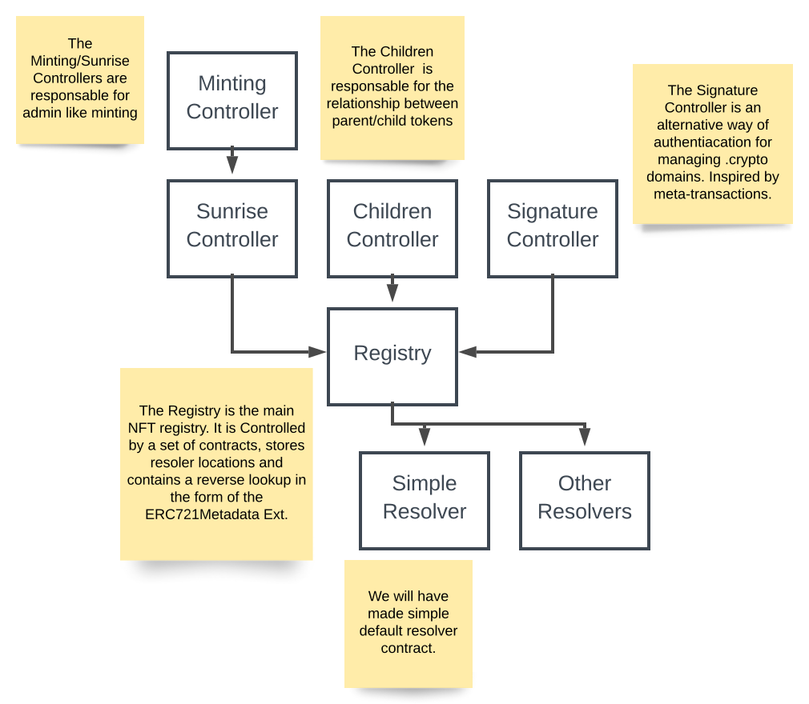

# .crypto

Contracts and tools for .crypto.

## Inheritance Hierarchy

## High level bullet points

dot-crypto is a name registry similar to ZNS. See https://github.com/unstoppabledomains/zns

ZNS was inspired by ENS. See https://eips.ethereum.org/EIPS/eip-137.

Here are some of the characteristics we share.

- Domain storage as a hash, or `uint256`.

- Subdomain derivation is using the `namehash` alg.

- A resolver system.

It differs in a couple important ways.

- Domains are `ERC721` Tokens.

- Minting of domains is centralized.

- No rent/annual fee on purchased names. Once you own a domain you keep it.

  - Except for potentially trademarked domains.

- We are trademark "aware". Select names get flagged on minting using the
  `SunriseController`. We reserve the right to takedown sunrise names for an
  indeterminate period of time.

- Most non-erc721 logic is hosted inside a set of `Controller` contracts.

  - The registry has a set of controlled functions to interface with these controllers.

### Ours

### OpenZeppelin
